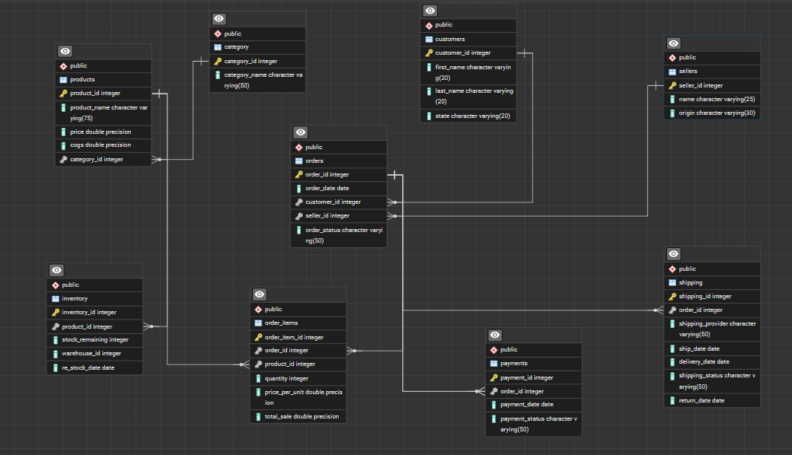

[novacart_sql_readme.md](https://github.com/user-attachments/files/25873721/novacart_sql_readme.md)
# Novacart E‑commerce Data Analytics Project -- SQL Analysis


## Overview

This repository contains the **SQL phase of an end‑to‑end data analytics
project** built for a fictional e‑commerce company **Novacart**.

The objective of this stage is to:

-   Design a relational database schema
-   Perform data cleaning and validation
-   Prepare structured data for analytics and BI tools

The cleaned and structured dataset will later be used for:

-   **Power BI dashboards**
-   **Machine Learning models**

------------------------------------------------------------------------

# Database Architecture

The database models a typical **e‑commerce transaction system**
including:

-   Customers
-   Sellers
-   Products
-   Orders
-   Payments
-   Shipping
-   Inventory

These tables are connected through **primary and foreign key
relationships** to ensure referential integrity.

------------------------------------------------------------------------

# Entity Relationship Diagram

Below is the schema used in the project.

> Place the ERD image inside this folder with the name **erd.png**



------------------------------------------------------------------------

# Database Tables

## Category

Stores product categories.

  Column          Description
  --------------- ------------------
  category_id     Primary key
  category_name   Name of category

------------------------------------------------------------------------

## Customers

  Column        Description
  ------------- ---------------------
  customer_id   Primary key
  first_name    Customer first name
  last_name     Customer last name
  state         Customer location

------------------------------------------------------------------------

## Sellers

  Column      Description
  ----------- ---------------
  seller_id   Primary key
  name        Seller name
  origin      Seller origin

------------------------------------------------------------------------

## Products

  Column         Description
  -------------- --------------------
  product_id     Primary key
  product_name   Product name
  price          Selling price
  cogs           Cost of goods sold
  category_id    Category reference

------------------------------------------------------------------------

## Orders

  Column         Description
  -------------- --------------------
  order_id       Primary key
  order_date     Date of order
  customer_id    Customer reference
  seller_id      Seller reference
  order_status   Order status

------------------------------------------------------------------------

## Order Items

  Column           Description
  ---------------- --------------------
  order_item_id    Primary key
  order_id         Order reference
  product_id       Product reference
  quantity         Quantity purchased
  price_per_unit   Unit price

------------------------------------------------------------------------

## Payments

  Column           Description
  ---------------- -----------------
  payment_id       Primary key
  order_id         Order reference
  payment_date     Date of payment
  payment_status   Payment result

------------------------------------------------------------------------

## Shipping

  Column              Description
  ------------------- -------------------------
  shipping_id         Primary key
  order_id            Order reference
  shipping_provider   Delivery service
  ship_date           Shipping date
  delivery_date       Delivery date
  shipping_status     Delivered / Returned
  return_date         Return date if returned

------------------------------------------------------------------------

## Inventory

  Column            Description
  ----------------- ---------------------
  inventory_id      Primary key
  product_id        Product reference
  stock_remaining   Remaining inventory
  warehouse_id      Warehouse ID
  re_stock_date     Restock date

------------------------------------------------------------------------

# Data Cleaning Process

Several transformations were applied to improve data quality.

## Payment Status Standardization

Original inconsistent values were normalized.

Before: - pending - payment_failed - payment_success

After: - refunded - failed - success

------------------------------------------------------------------------

## Removing Duplicate Records

Duplicate shipping records were identified and removed using
PostgreSQL's system column.

Example:

``` sql
DELETE FROM shipping
WHERE ctid NOT IN (
    SELECT MIN(ctid)
    FROM shipping
    GROUP BY shipping_id
);
```

------------------------------------------------------------------------

## Shipping Status Normalization

Shipping statuses were standardized to two categories:

-   delivered
-   returned

Approximately **7% of orders were randomly marked as returned** to
simulate real‑world e‑commerce behavior.

------------------------------------------------------------------------

## Return Date Generation

A return date column was introduced.

``` sql
ALTER TABLE shipping
ADD COLUMN return_date DATE;
```

Return dates were generated relative to delivery date.

------------------------------------------------------------------------

# Data Validation Checks

Several rules were verified to ensure logical data relationships.

### Delivery cannot occur before shipping

``` sql
SELECT *
FROM shipping
WHERE delivery_date < ship_date;
```

### Payments cannot occur before order date

``` sql
SELECT p.*
FROM payments p
JOIN orders o
ON p.order_id = o.order_id
WHERE p.payment_date < o.order_date;
```

Incorrect values were corrected.

------------------------------------------------------------------------

# Data Integrity Improvements

Foreign key constraints were strengthened.

Example:

``` sql
ALTER TABLE shipping
ADD CONSTRAINT shipping_order_fk
FOREIGN KEY (order_id)
REFERENCES orders(order_id)
ON DELETE CASCADE;
```

This ensures related records are deleted automatically when an order is
removed.

------------------------------------------------------------------------

# Technologies Used

-   SQL
-   PostgreSQL
-   Relational Database Design
-   Data Cleaning Techniques

------------------------------------------------------------------------

# Project Structure

    Novacart-ecommerce-project
    │
    ├── 1_SQL_Database_Analysis
    │   ├── database_schema.sql
    │   ├── data_cleaning.sql
    │   ├── business_queries.sql
    │   ├── erd.png
    │   └── README.md
    │
    ├── 2_PowerBI_Dashboard
    │
    └── 3_Machine_Learning

------------------------------------------------------------------------

# Future Project Phases

## Phase 2 -- Power BI Dashboard

Interactive dashboards will be built to analyze:

-   Sales trends
-   Customer behavior
-   Product performance
-   Return patterns

## Phase 3 -- Machine Learning

Planned models:

-   Customer segmentation
-   Demand forecasting
-   Return prediction

------------------------------------------------------------------------

# Author

**Vishva Jayasinghe**\
Aspiring Data Analyst
